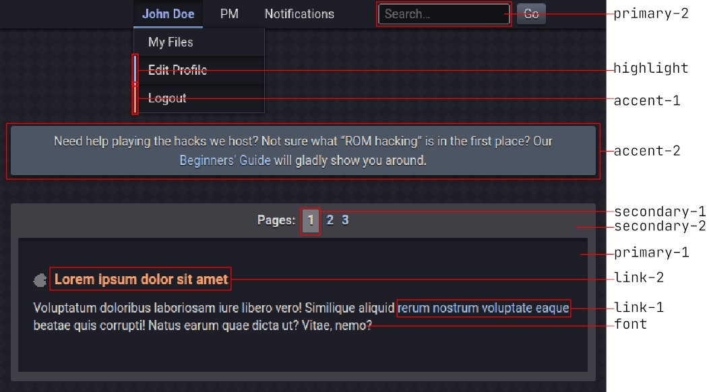

# SMW Central - Site Schemes
All of the site schemes available on [SMW Central](https://www.smwcentral.net/). This repository also contains the files necessary to create a custom site scheme.

## Layout
The site schemes are stored in the `schemes` directory. The template for making a new scheme is in `template`. The `common` directory is split from the site's code and contains the bare minimum Sass code required to build a scheme.

## Making a new scheme
Anyone can make a scheme - no need to ask! After you're done, send us a pull request or get in touch directly.

To get started, copy the `template` directory into `schemes` and rename it to match your scheme. Then, edit the comment at the top of `_custom.scss` to include your scheme's name and your username.

The main file in a scheme is `_palette.scss`. It contains [variables](https://sass-lang.com/documentation/variables) that define the colors of your schemes. Change `$light` to `true` if you're making a light scheme (it mainly influences the font color). `$palette` is a [map](https://sass-lang.com/documentation/values/maps) containing the color palette. Do not remove any of the entries from `$palette` or add any new ones.

This image shows example uses of all colors from the palette. Note that these are only examples - colors are widely reused across different components.

You can put any CSS you want in `_custom.scss`. You may use any of Sass's features if you wish, including the mixins from the `common` files (check the existing schemes for examples). **Please limit your custom CSS to a minimum**, as it will not be supported by the development team and may get broken at any time (the "official" schemes are an example of what custom CSS *shouldn't* look like).

Do not edit `schemes/scheme.scss` or anything in the `common` directory.

## Building
SMW Central uses Sass to preprocess its CSS. If you want to preview a scheme, you need to convert the SCSS files to CSS usable in a browser.

Assuming you have [Node](https://nodejs.org/en/) installed on your computer, start by running `npm install` to download Sass.

Then, run `npm run build -- <name>` to build a given scheme. For example, to build the default scheme, run `npm run build -- default`.

Schemes are built as `schemes/scheme.css`. You can then use your browser's developer tools or an extension such as Stylish or Stylus to insert the file into an SMW Central page.

## Support
Feel free to ask [Telinc1](https://smwc.me/u/15661) if you have any questions regarding the schemes.

Note that the "legacy schemes" from the old site design are not, and won't be, included in this repository due to their complexity. The code for individual schemes will be provided on-demand if you want to port or re-create one.

## License
Released under the [MIT License](https://github.com/SMWCentral/Schemes/blob/main/LICENSE.md).

## Credits
Built and maintained by [Telinc1](https://github.com/telinc1). SMW Central is property of [Noivern](https://smwc.me/u/6651).

## Version
The included SCSS files are split from commit `1a370de` of the SMW Central source code.
